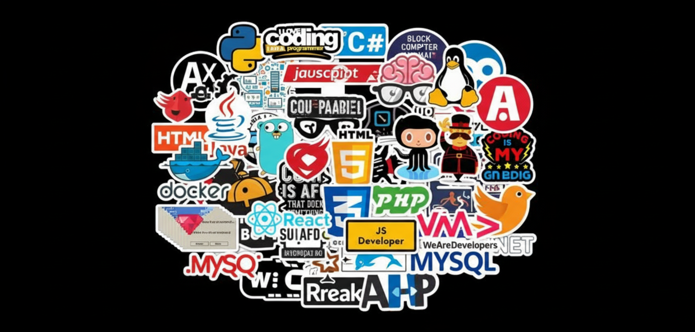

  
  
  

   
  
  

   

  <h2>🚀 Dedicated to Building Scalable and Innovative Solutions</h2>
  
  

    
    
  

  
  

  

## 🌟 About Me
<h3>I'm Ishan Prabhashana </h3>
I am a passionate Software Engineering student dedicated to learning and applying modern technologies. I thrive on challenges and enjoy turning innovative ideas into functional software solutions.

* **📚 Field of Study:** Deep learning in Scalable System Architectures and Full-Stack Development.
* **🎯 Goals:** Securing an industry internship to apply theoretical knowledge to real-world projects.
* **🤝 Looking to collaborate on:** Open Source projects focused on AI/ML or Web Accessibility.

    

<h2 align="start">⚙️ My Creative Tech Stack </h2>

Technologies I love to work with and contribute to:

  
  ### Languages & Backend
  

  ### Frontend & UI/UX
  

  ### Databases & Cloud
  

  ### Tools & Other
  

   

---

<h2 align="center">🤝 Cᴏɴɴᴇᴄᴛ Wɪᴛʜ Mᴇ 🤝 </h2>

Connect with me for projects, discussions, or just to say hello!

  &nbsp;&nbsp;
  &nbsp;&nbsp;
  

  

